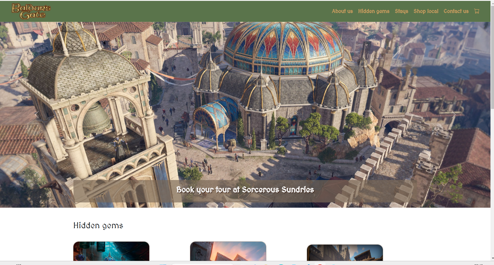
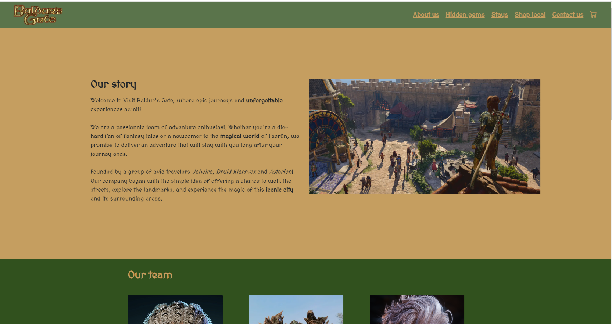
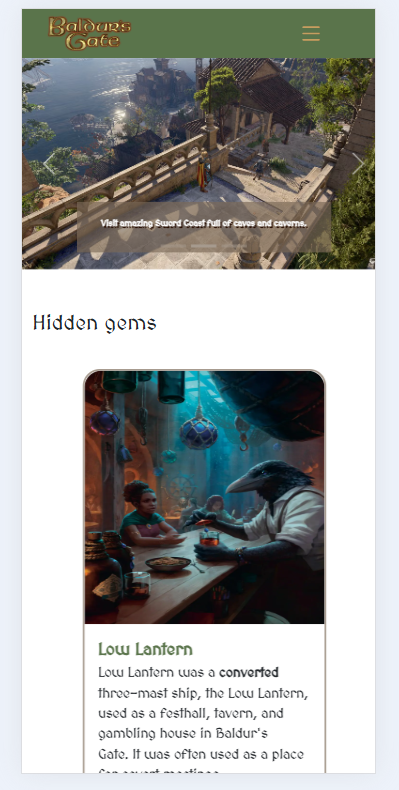

# Tourism website "Discover Baldur's Gate"

## Project Description
"Discover Baldur's Gate" is an interactive tourism website binspired by city Baldur's Gate from Dungeons &D ragons lore and Baldur's Gate 3 game.

The website is designed to guide visitors though the city's acommondatipon options, hidden gems and local shopping.

The user interface is thematically crafted that mirrors game's enviroment.

## Technologies Used
- HTML
- CSS
- Vanilla JavaScript
- Bootstrap 5
- Bootstrap icons
- Animations: https://michalsnik.github.io/aos/
- Map:https://mapgenie.io/baldurs-gate-3/maps/baldurs-gate 
- HTML5 elements used (header, footer, section,Persistent local storage,mobile compatibility )

## Installation Instructions
Copy repo to your terminal.
Run git clone "repo link"
Either open HTML file to see the website or install Live Server extention.

## Features of the website
### CORE FETURES:
- Homepage,
- About page,
- Contact page, 
- Shopping cart (local goods),
- Places of hospitality (hotels/stays), 
- Hidden secrets/ places to visit (interactive map), 
- Responsive design- for different screen sizes & for all modern browsers,
- Interactive contact feature,
- Validation for the contact form,
- SEO keywords,
- virtual tour video

### NICE TO HAVE:
- Accessibility options (high contrast, big letters, audio controls),
- Interactive itinerary builder,
- Audio guides & narration
- Local Event Calendar
- Traveler Reviews and Ratings
- 360-Degree Photos and Videos

### Overview 
Home page

About us page

Mobile

